# Capstone-Project- Onilne_Shoppers_Intention
Problem Definition - Developing a Machine Learning model aimed at Predicting the online shoppers purchase intentions(Yes/No)
Objective          - We can identify the unique pattern for the shoppers with the help of past data and identify the future customers intention.
                     - Can identify the potential customers.
                     - Gather insights on the features to target to improvise the customer conversion rate.

## Data For eCommerce

In the last two years, this is a term that has become synonymous with eCommerce analytics. It entails sifting through massive amounts of data (Think hundreds of terabytes)
in order to reach a scientific, statistic-based solution to a problem. It’s a burgeoning field, with a continuously growing scope. Big data can be valuable for eCommerce business
owners, for a variety of reasons:
                      - Behavioral Targeting
                      - eCommerce Personalization
                      - Customer Satisfaction
                      - Dynamic Pricing
                      - End-To-End Analytics

## DataSet 

The dataset consists of feature vectors belonging to 12,330 sessions.

The dataset was formed so that each session would belong to a different user in a 1-year period to avoid any tendency to a specific campaign, special day, user profile, or period.

Dataset Features

Administrative, Informational, Product Related represent the number of different types of pages visited by the visitor in that session and total time spent in each of these page categories.

The Bounce Rate, Exit Rate and Page Value features represent the metrics measured by "Google Analytics" for each page in the e-commerce site.

## Exploratory Data Analysis

Univariate Analysis:

                            Revenue Generated: (Target)
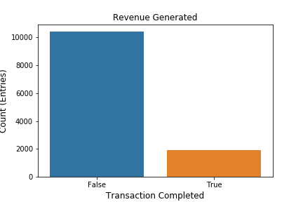
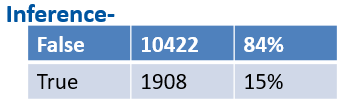

- We need to focus on the 84% to generate more revenue.
- Based on the distribution, it's an imbalance dataset.

                 Visitor Behavior and Weekend Session Revenue Distribution:

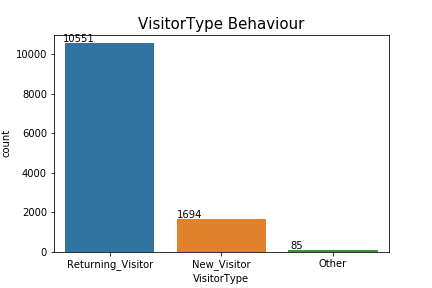      
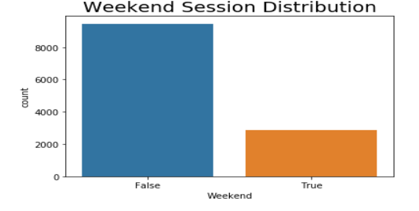

Inference:
- You see that 85% percentage of returning visitors on this website, But the revenue conversion is low so we need to check.
- You can observe that the conversion rate is also high for the new-Visitor, so there is a high possibility for conversion. We need to focus on the new visitor also with ads/digital marketing
- Average exit rate for the new-visitor is comparatively less than the returning customer(it may be due to the distribution, let’s see)
- There are a lot of visitor sessions found during weekday rather than weekend. Which might be due to the reason that customer prefer to shop directly in stores during weekends rather than online
- Revenue conversion rate during the weekend is slightly greater than weekday.
- 76% of customers are visiting the website on weekdays.   

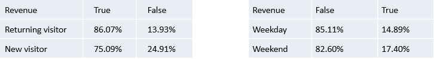

                          Region Wise Session Distribution
      
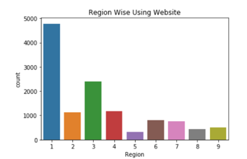  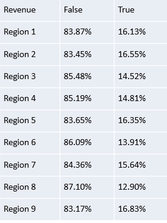

Inference:

- The customers visiting the online website are most of them region 1 and 3- contributing around more than 50% of the overall region.
- Region 9 has more conversion rate so let's take them into consideration.

                          Month Wise Session Distribution
                          
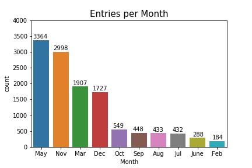  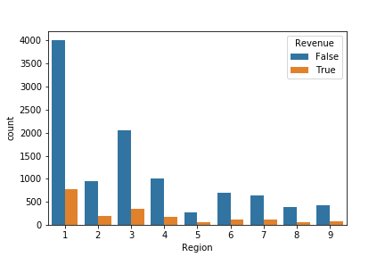

Inference:

- Jan & April month are missing(As data are collected on random)
- 80% of customers are visiting the website in the month of may,nov,mar,dec. They should mainly concentrate on these months.
- Website visitors may be high in May, but actual Sales conversion took place in the month of November. We need to find a successful conversion rate Month wise for further understand

                           Special Day Wise Session Distribution
                           
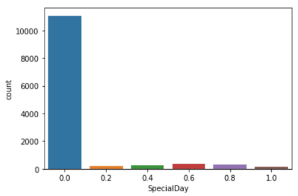  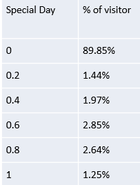

Inference-

- 90% online session happen on non-special days they buy 10 days before the function
- We need to look on November,December special day

                                  Page View

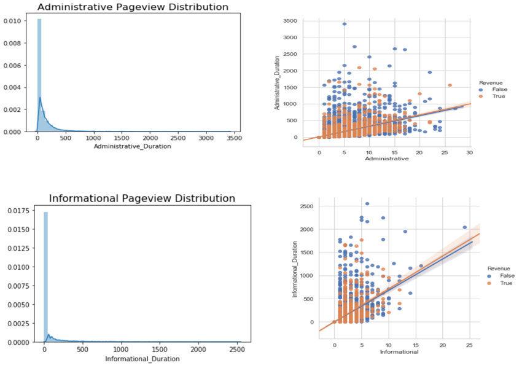 

Inference:

- When the page value increases the revenue is generated.
- Administrative, Informational and their duration have been Right skewed. Spend less time in the particular region , we need to find the reason to improvise.
- Possible Reasons- Administrative, check if there are any login problems. Informational, even if they spend so much time they end up without buying.
- Customers who spent a longer administrative duration in a website are very less likely to bounce from the website that is navigating away from the website just after navigating one page of that website.

                            Bounce Rate & Exit Rates:

 

Inference:

- A high bounce rate could indicate issues with user satisfaction owing to one or many reasons such as unfriendly user interface of the website, extremely slow throughput or other technical matters.
- A high exit rate could be a sign of lower performing sectors in funnels, showing areas open to optimization as if customers are leaving then at the end of the day no one is buying.
- Here both of them exhibiting a positive relation- we need to try to control both to gain new customers and old customers to sustain.

### Feature Selection

                              Chi Square Test

- Chi Square test is works when the independent and dependent variable is categorical.

- It is a non parametric test/test of independence deals with degree of freedom and alpha.

Hypothesis:
  - H0: Assumes that there is no association between the two varaibles
  - H1: Assumes that there is a association between the two varaibles

-Features comparison of nominal variable in relation on target column(Revenue- binary classification) based on p value from chi square test

* Dependent- Weekend,Special day,Visitor type,Browser,Month,Traffic type
* Independent- Region

     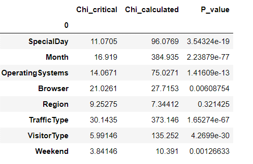 

                                    ANOVA Test

ANOVA uses F-test check if there is any significant difference between the groups.

If there is no significant difference between the groups that all variances are equal, the result of ANOVA’s F-ratio will be close to 1.

Hypothesis:
  - H0: All levels or groups in dataset have equal variance/ No significant effect on revenue
  - H1: At least one group is different/ significant effect on revenue

* All our variables except “Informational_Duration” have rejected the null hypothesis and the hypothesis is in favor of alternate hypothesis which states that the mean
of two groups are not equal which will help in splitting our target variable.

   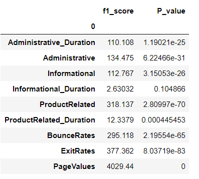 

                                  Performance Metrics:

- It's an imbalance classification problem, the performance metrics planned to estimate the performance are f1_score, Precision, Recall, ROC_curve , Bias and Variance error.

- Primary - F1 is an overall measure of a model’s accuracy that combines precision and recall. A good F1 score means that you have low false positives and low false negatives, so you’re correctly identifying real threats and you are not disturbed by false alarms. 
- An F1 score is considered perfect when it’s 1, while the model is a total failure when it’s 0.

    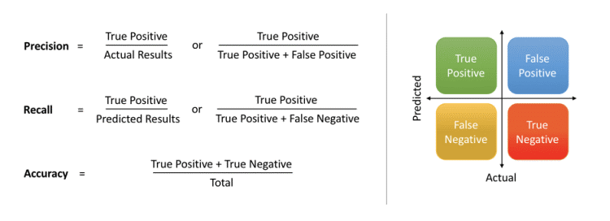 

                                Bias_Error and Variance_Error

Considering the overall bias error and variance error of the model in order to make the final choice among the performance.
    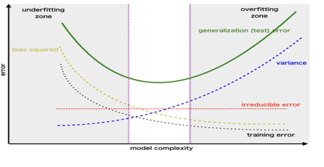

                                Algorithms considered

                            Machine Learning Modelling

Results obtained after the feature selection

   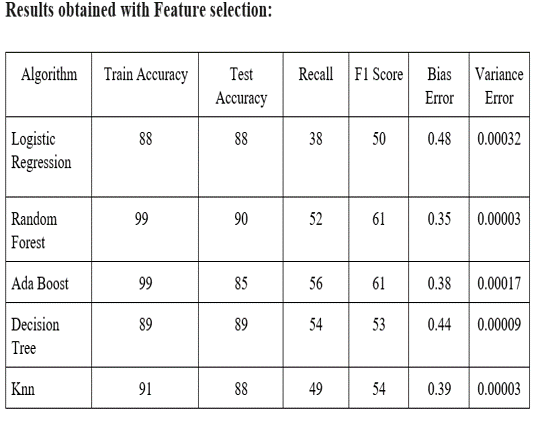   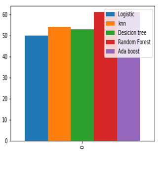

SMOTE(Synthetic Minority oversampling technique)

   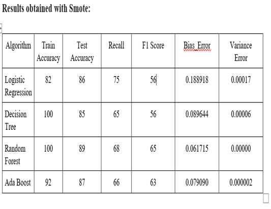   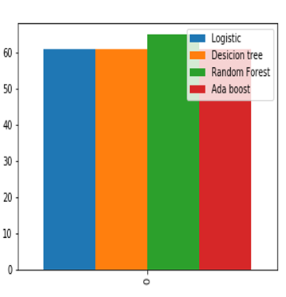

Cons:
Possibility of imbalance is more practical compared to the sampling technique applied.

Hyper Parameter tuning

Hyperparameter tuning is choosing a set of optimal hyperparameters for a learning algorithm. The methods that are used most commonly in hyper parameter tuning are
  *Grid Search
  *Random Search

   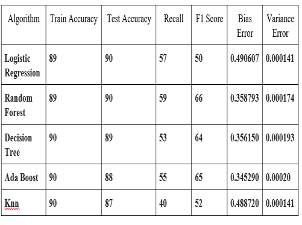   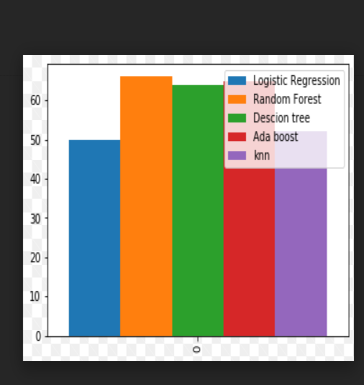

AUROC_Curve

AUC (Area Under The Curve) ROC (Receiver Operating Characteristics) curve. It is one of the most important evaluation metrics for checking any classification model’s
performance.
    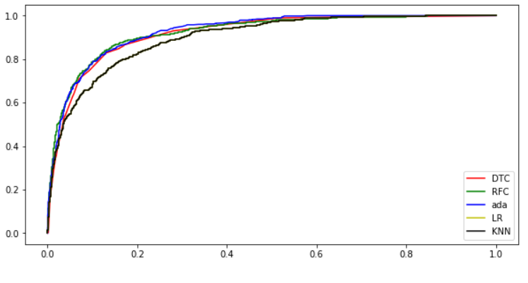

### Conclusion

Online Shoppers intension dataset is an imbalance dataset and we have identified the feature of importance with appropriate recommendation for the improvement of the conversion rate among the shoppers.

With respect to the prediction of the shoppers- tree based model perform better, with the randomized hyper parametric tuning it is final model chosen with respect to f1_score as an performance metrics.
